```mermaid
  graph LR;
  
  %% what
  design[Design]
  deployment[Deployment]
  viability[Viability & Order]
  provisioning[Provisioning]
  activation[Activation]
  certification[Certification]
  change[Change Order]
  troubleshooting[Troubleshooting]
  expansion[Expansion]
  newproduct[New Product Specification]
 
  
  What --> design --> deployment --> viability  --> provisioning  --> activation  --> certification  --> change  --> troubleshooting  --> expansion  --> newproduct

  newproduct --> design
  change --> provisioning

    style design fill:#c1ff1c
    style deployment fill:#58bb43
	  style viability fill:white
    style provisioning fill:#caf0f8
    style activation fill:#90e0ef
	  style certification fill:#00b4d8
    style change fill:#fb8500
    style troubleshooting fill:#fb8500
	  style expansion fill:#ffb703
    style newproduct fill:silver

```

# TelcoLab
[DRAFT REPOSITORY]   
This is a Working in Progress (W.I.P) proof-of-concept (POC). 

## Objective 
 
To collect information, tools and configurations that can support network lab operations.

## Description

Services lifecycle macro segmentation :

### Requested Features
##### Information
- Subscriber Topology tracer.
-- Element model, Element vendor, if phy, if log, vlans, ips, versions.
- Lab configuration dump and versioning. 

### How It Works

##### Applications / RobotFramework

### Change Log

- Included reference samples for Robot Framework usage in Applications / RobotFramework

